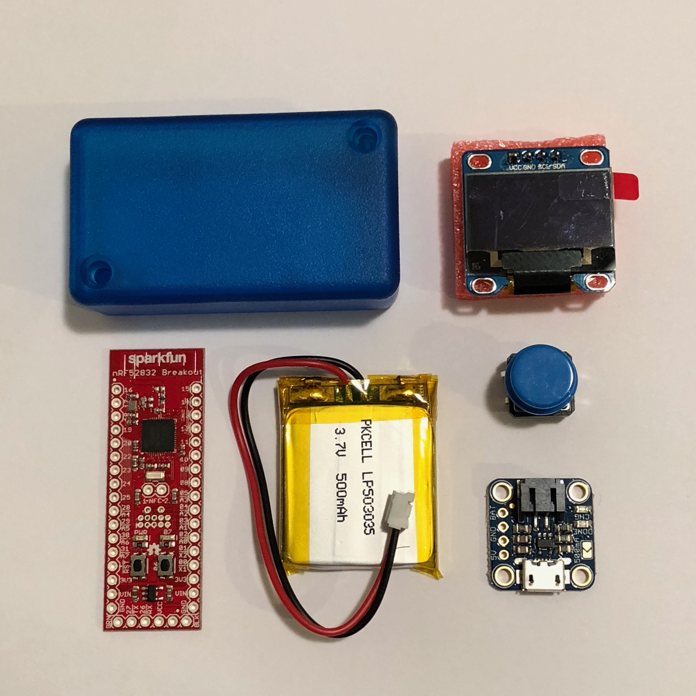
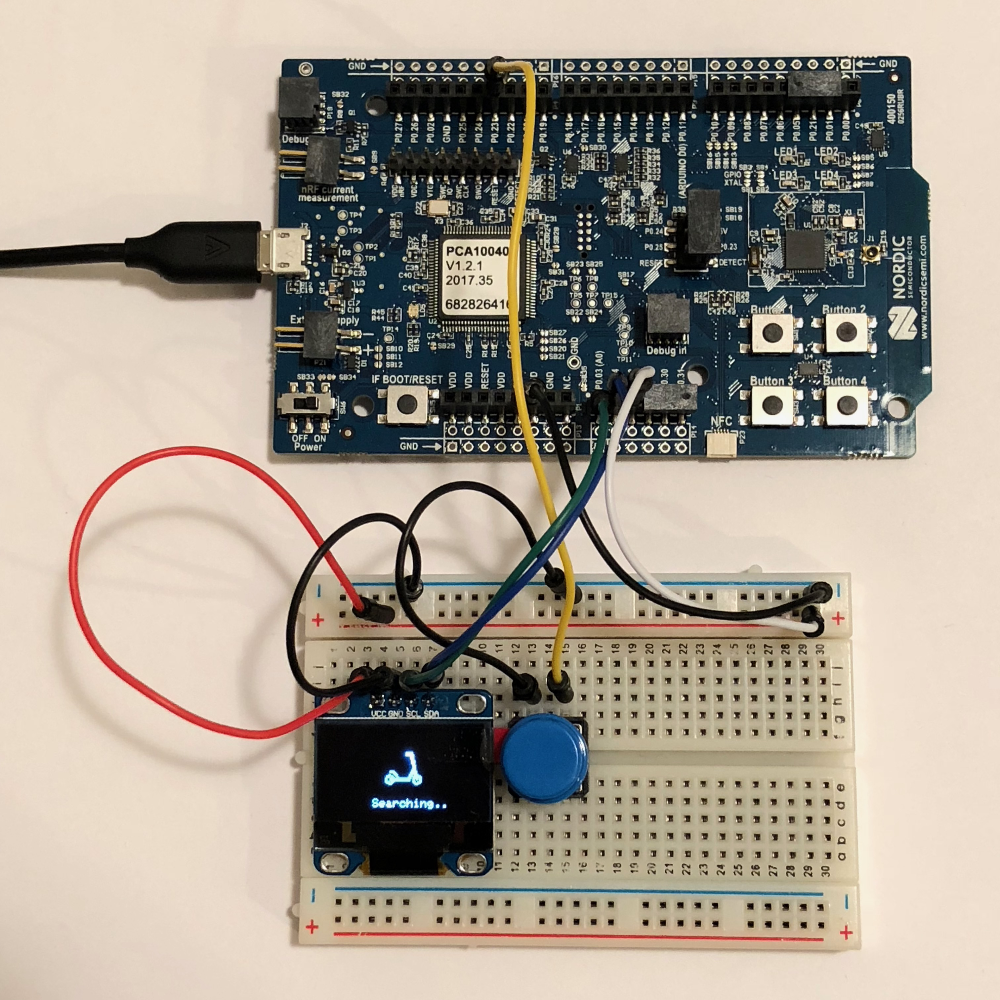
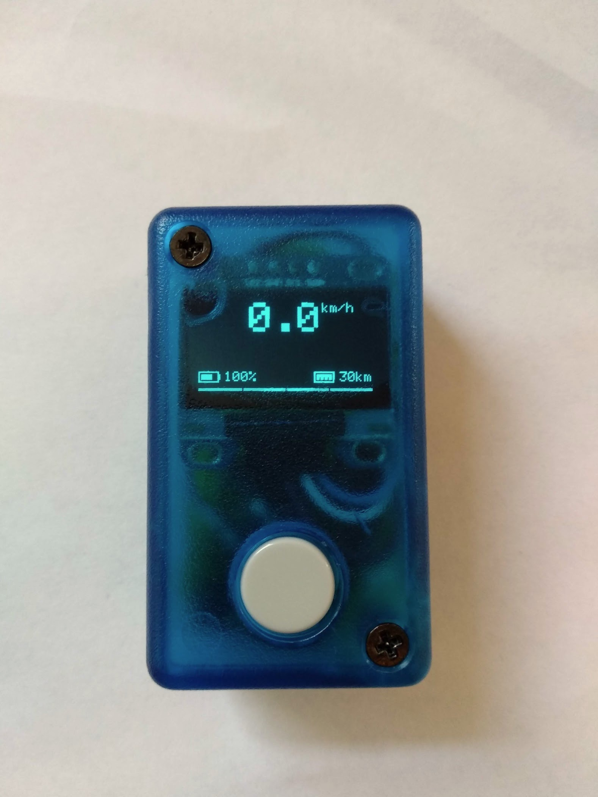

# Xiaomi M365 Scooter Dashboard

An OLED display for your [Xiaomi M365 Scooter](https://www.amazon.com/gp/product/B076KKX4BC/ref=as_li_tl?ie=UTF8&camp=1789&creative=9325&creativeASIN=B076KKX4BC&linkCode=as2&tag=heardrwt-20&linkId=20a3379f0dbe53111d9826211fabb4f0), based on the [Nordic Semiconductor nRF52832](https://www.nordicsemi.com/eng/Products/Bluetooth-low-energy/nRF52832) SoC.

## Supported properties
The display can currently show the following properties, read directly from the scooter over BTLE.

* Current Speed (mph / kph)
* Battery percentage 
* Remaining Distance (mi / km)

## Build Hardware
* [SparkFun nRF52832 Breakout](https://www.amazon.com/gp/product/B01N55QWTX/ref=as_li_tl?ie=UTF8&tag=heardrwt-20&camp=1789&creative=9325&linkCode=as2&creativeASIN=B01N55QWTX&linkId=c59e1a3fb01aae148760b81ffe74ed87) (WRL-13990)
* [Adafruit Round Tactile Buttons](https://www.adafruit.com/product/1009) (Adafruit 1009)
* [Diymall 128x64 0.96" I2C OLED](https://www.amazon.com/gp/product/B00O2KDQBE/ref=as_li_tl?ie=UTF8&tag=heardrwt-20&camp=1789&creative=9325&linkCode=as2&creativeASIN=B00O2KDQBE&linkId=5ebd87b3873786580d6ab6edfd369a5f) (SSD1306 driver)
* [Adafruit Micro-Lipo Charger](https://www.adafruit.com/product/1904) (Micro USB - v1)
* [Hammond Transparent Blue Enclosure](https://www.hammfg.com/electronics/small-case/plastic/1551) (1551HTBU)
* [Lithium Ion Polymer Battery](https://www.adafruit.com/product/1578) (3.7v 500mAh)

## Development Hardware
* [Nordic nRF52 Development Kit](https://www.nordicsemi.com/eng/Products/Bluetooth-low-energy/nRF52-DK) (nRF52832)
* [SEGGER J-Link EDU Mini](https://www.amazon.com/gp/product/B0758XRMTF/ref=as_li_tl?ie=UTF8&tag=heardrwt-20&camp=1789&creative=9325&linkCode=as2&creativeASIN=B0758XRMTF&linkId=114f4c84529012debd3c79d4f4aa15f3) (optional)

## Software
* [Nordic nRF5 SDK](https://www.nordicsemi.com/eng/nordic/Products/nRF5-SDK/nRF5-SDK-v12-zip/54291) (v12.3.0)
* [Nordic S140 SoftDevice](https://www.nordicsemi.com/eng/Products/S140-SoftDevice) (for nRF52840)
* [SEGGER Embedded Studio for ARM](https://www.segger.com/products/development-tools/embedded-studio/) (v3.34a)

## Various Photos
### Build Hardware Parts

### Breadboard Prototype

### Fully Assembled

## Other Resources
* [CamiAlfa - M365-BLE-PROTOCOL](https://github.com/CamiAlfa/M365-BLE-PROTOCOL/)
* [monpetit - nrf52-spi-i2c-master-ssd1306](https://github.com/monpetit/nrf52-spi-i2c-master-ssd1306)
* [ses\_nrf52\_startup.s](https://devzone.nordicsemi.com/f/nordic-q-a/31187/segger-embedded-studio-vs-iar-different-debugging-behavior)
* [Emeryth - ReadM365](https://github.com/Emeryth/ReadM365)